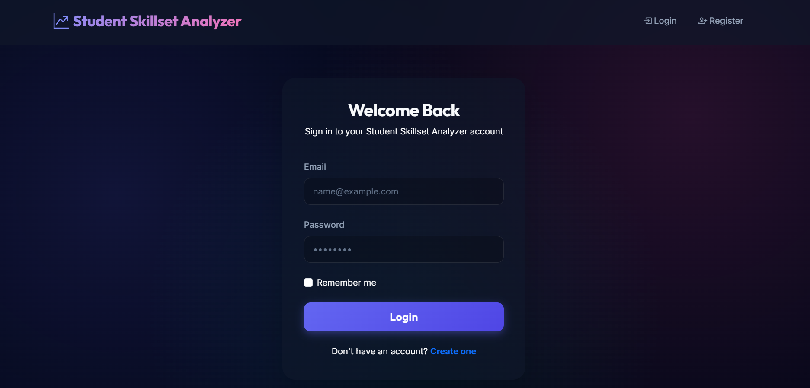
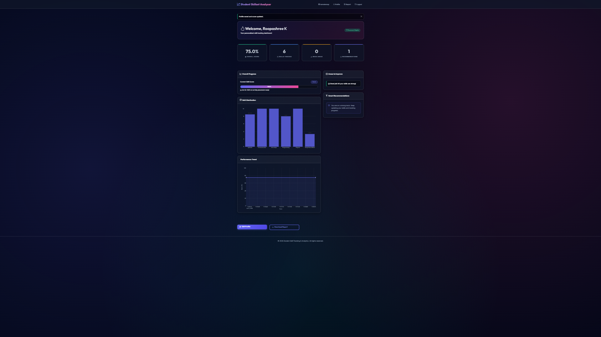
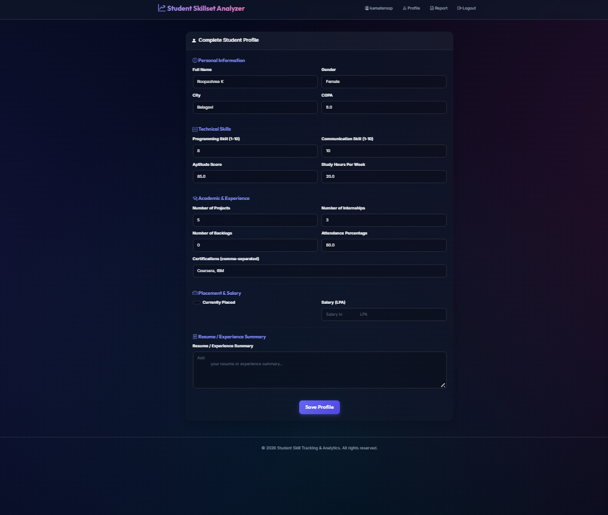
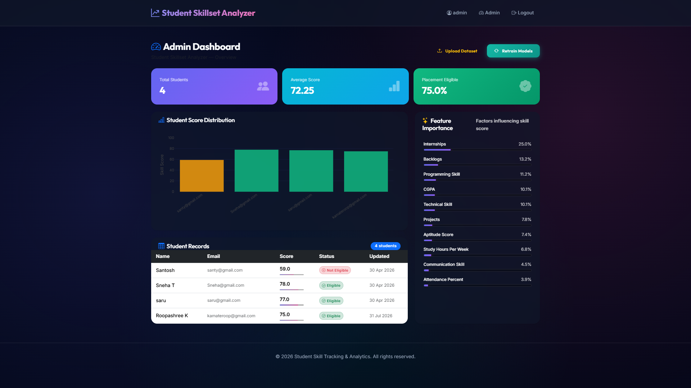
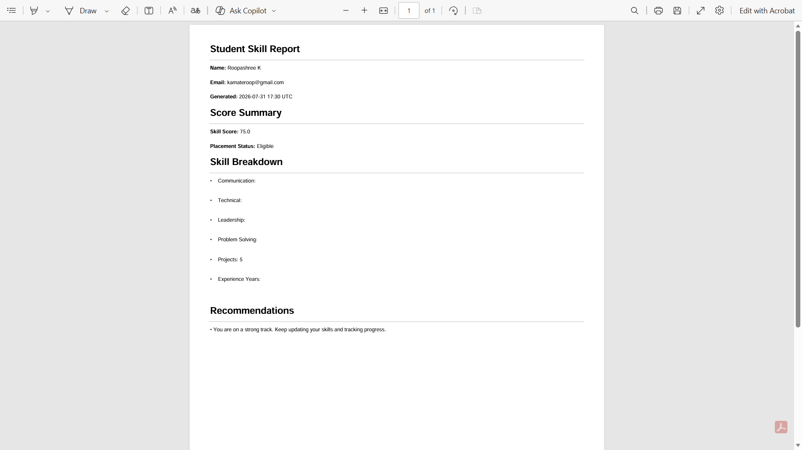

# 🎓 Student Skillset Analyzer


A Machine Learning-based web application that analyzes student skills, predicts placement readiness, and provides personalized recommendations to help students improve their employability.

---

## 🚀 Live Demo

🌐 **Application:** 

    https://student-skillset-analyzer.onrender.com

---

## 📌 Project Overview

Student Skillset Analyzer is designed to evaluate a student's technical and soft skills using Machine Learning algorithms. Based on the provided information, the application predicts placement readiness and generates personalized recommendations for skill improvement.

The application also includes user authentication, profile management, dashboard visualization, and PDF report generation.

---

## ✨ Features

- 🔐 User Registration & Login
- 👤 Student Profile Management
- 🤖 Machine Learning-based Skill Prediction
- 📊 Interactive Dashboard
- 📈 Placement Readiness Analysis
- 💡 Personalized Recommendations
- 📄 Downloadable PDF Report
- 👨‍💼 Admin Dashboard

---

## 🛠️ Tech Stack

### Frontend
- HTML5
- CSS3
- Bootstrap
- JavaScript

### Backend
- Python
- Flask

### Machine Learning
- Scikit-learn
- Pandas
- NumPy

### Database
- SQLite

### Visualization
- Plotly

### Authentication
- Flask Login
- Flask-WTF

### Deployment
- Render

---

## 📸 Application Screenshots

### 🏠 Home Page



---

### 📊 Student Dashboard



---

### 👤 Student Profile



---

### 👨‍💼 Admin Dashboard



---

### 📄 PDF Report



---

## 📂 Project Structure

```
student-skillset-analyzer/
│
├── app.py
├── config.py
├── models.py
├── forms.py
├── recommender.py
├── ml_utils.py
├── requirements.txt
├── skill_model.pkl
├── skill_scaler.pkl
├── skta.db
│
├── data/
├── static/
├── templates/
├── screenshots/
└── README.md
```

---

## ⚙️ Installation

### Clone Repository

```bash
git clone https://github.com/KTSneha/student-skillset-analyzer.git
```

```bash
cd student-skillset-analyzer
```

### Create Virtual Environment

```bash
python -m venv venv
```

### Activate Environment

Windows

```bash
venv\Scripts\activate
```

Linux / macOS

```bash
source venv/bin/activate
```

### Install Dependencies

```bash
pip install -r requirements.txt
```

### Run Application

```bash
python app.py
```

Application runs on

```
http://127.0.0.1:5000
```

---

## 📈 Machine Learning Workflow

- Data Collection
- Data Preprocessing
- Feature Engineering
- Model Training
- Prediction
- Recommendation Generation
- Placement Readiness Analysis

---

## 🎯 Project Objectives

- Analyze student skill sets
- Predict placement readiness
- Identify skill gaps
- Recommend improvement strategies
- Improve employability through data-driven insights

---

## 👩‍💻 Developed By

**Sneha K T**

🎓 B.E. Computer Science & Engineering

💼 Aspiring Data Analyst | Business Analyst | MIS Analyst

---

## 🔗 Connect With Me

### GitHub

https://github.com/KTSneha

### LinkedIn

https://www.linkedin.com/in/sneha-timmavvagol/

---

## ⭐ Support

If you found this project useful, consider giving it a ⭐ on GitHub.

It motivates me to build more projects.

---

## 📄 License

This project is developed for educational and portfolio purposes.
